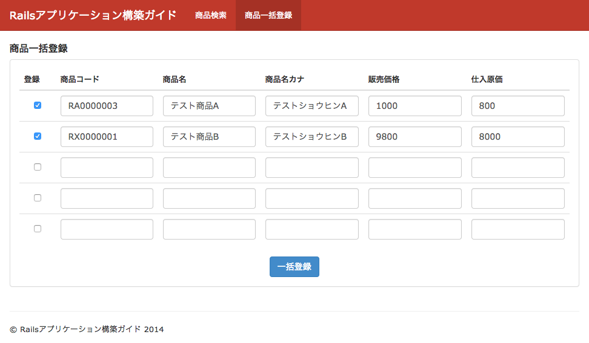

============================================================================
一括登録フォームの実装
============================================================================

課題: 商品一括登録画面の実装
============================================================================

今回は一括登録画面について、販売管理システムのサンプルアプリケーションを例に考えてみます。

この販管システムでは商品マスタ情報を一括新規登録することが可能です。
実装したい新規登録画面は下図の通りです。

  販売管理システム - 商品一括登録画面

システムはproducts(商品)テーブルを持ちます。
productモデルは以下の通りです。

.. code-block:: ruby

  # == Schema Information
  #
  # Table name: products
  #
  #  id            :integer          not null, primary key
  #  code          :string(10)       not null                 # 商品コード
  #  name          :string(50)       not null                 # 商品名
  #  name_kana     :string(50)       default(""), not null    # 商品名カナ
  #  price         :integer          not null                 # 商品価格
  #  purchase_cost :integer          not null                 # 仕入原価
  #  availability  :boolean          default(FALSE), not null # 販売可能フラグ
  #  created_at    :datetime
  #  updated_at    :datetime
  #

  class Product < ActiveRecord::Base
    validates :code, presence: true, length: { maximum: 10 }
    validates :name, presence: true, length: { maximum: 50 }
    validates :name_kana, kana: true, length: { maximum: 50 }
    validates :price,
               presence: true,
               numericality: { only_integer: true, greater_than_or_equal_to: 0 }
    validates :purchase_cost,
               presence: true,
               numericality: { only_integer: true, greater_than_or_equal_to: 0 }
    validates :availability, inclusion: { in: [true, false] }
  end

システムの要件は以下の通りです。

- 一括登録画面では最大5件までの商品が登録可能であること

- 以下条件を満たす商品のみ登録可能とする

  - 登録チェックボックスにチェックがある商品のみ登録可能とする

    - チェックのない商品のバリデーションはスキップすること

  - 各種バリデーションが通っている商品のみ登録可能とする

    - バリデーションを満たしていない場合はエラーメッセージを表示すること

商品一括登録用のフォームオブジェクトを実装する
============================================================================

Viewから受け取ったパラメータを加工し、Productモデルにマッピングしていくという複雑なロジックを、controller内で実装するべきではありません。
一括登録をスマートに実装するためには、一括登録用のフォームオブジェクトを作成することをお勧めします。

controller内の処理は以下のようになります。

.. code-block:: ruby

  class ProductsController < ApplicationController
    def new
      @form = Form::ProductCollection.new
    end

    def create
      @form = Form::ProductCollection.new(product_collection_params)
      if @form.save
        redirect_to :products, notice: "#{@form.target_products.size}件の商品を登録しました。"
      else
        render :new
      end
    end

    private

    def product_collection_params
      params
        .require(:form_product_collection)
        .permit(products_attributes: Form::Product::REGISTRABLE_ATTRIBUTES)
    end
  end

商品一括登録用のフォームオブジェクトを、ProductCollectionモデルとしました。
フォームオブジェクトの実装は以下の通りです。

.. code-block:: ruby

  # app/models/form/base.rb
  class Form::Base
    include ActiveModel::Model
    include ActiveModel::Callbacks
    include ActiveModel::Validations
    include ActiveModel::Validations::Callbacks

    def value_to_boolean(value)
      ActiveRecord::ConnectionAdapters::Column.value_to_boolean(value)
    end
  end

.. code-block:: ruby

  # app/models/form/product_collection.rb
  class Form::ProductCollection < Form::Base
    DEFAULT_ITEM_COUNT = 5
    attr_accessor :products

    def initialize(attributes = {})
      super attributes
      self.products = DEFAULT_ITEM_COUNT.times.map { Form::Product.new } unless products.present?
    end

    def products_attributes=(attributes)
      self.products = attributes.map do |_, product_attributes|
        Form::Product.new(product_attributes).tap { |v| v.availability = false }
      end
    end

    def valid?
      valid_products = target_products.map(&:valid?).all?
      super && valid_products
    end

    def save
      return false unless valid?
      Product.transaction { target_products.each(&:save!) }
      true
    end

    def target_products
      self.products.select { |v| value_to_boolean(v.register) }
    end
  end

.. code-block:: ruby

  # app/moels/form/product.rb
  class Form::Product < Product
    REGISTRABLE_ATTRIBUTES = %i(register code name name_kana price purchase_cost)
    attr_accessor :register
  end

一括登録のViewの実装は以下の通りです。

.. code-block:: erb

  # app/views/products/new.html.erb (重要な処理のみ抜粋)
  <%= form_for(@form, url: products_path, method: :post) do |fb| %>
  <table class="table">
  <thead>
    <tr>
      <th width="60px">登録</th>
      <th>商品コード</th>
      <th>商品名</th>
      <th>商品名カナ</th>
      <th>販売価格</th>
      <th>仕入原価</th>
    </tr>
  </thead>
  <tbody class="bulk-registration-form">
  <%= fb.fields_for :products do |f| %>
    <tr class="item">
    <td class="text-center">
    <%= f.check_box :register, class: 'top10 registration-checkbox' %>
    </td>
    <td>
    <%= f.text_field :code, class: 'form-control' %>
    </td>
    <td>
    <%= f.text_field :name, class: 'form-control' %>
    </td>
    <td>
    <%= f.text_field :name_kana, class: 'form-control' %>
    </td>
    <td>
    <%= f.text_field :price, class: 'form-control' %>
    </td>
    <td>
    <%= f.text_field :purchase_cost, class: 'form-control' %>
    </td>
  </tr>
  <% end %>
  </tbody>
  </table>

  

  <%= fb.submit '一括登録', class: 'btn btn-primary' %>
  

商品モデルを複数登録するために、Viewではfields_for メソッドを利用します。

ここでfields_forメソッドについて補足しておきます。
今回のサンプルでform_forに渡しているモデルはForm::ProductCollectionモデルですが、一括登録画面で実際に更新を行いたいモデルはForm::Productモデルです。
fields_forはform_for内で渡したモデルとは異なるモデルを編集できるようにするメソッドです。

fields_for を利用するためには、以下条件を満たす必要があります。

- fields_for の第一引数に渡した変数名の変数にアクセスできること
- 指定した変数が ``xxx_attributes=`` (xxx は変数名)という形式で更新できること

1つに、fields_for 第一引数に渡す変数にアクセスできる必要があります。
今回 ``fb.fields_for :products`` と宣言しているため、Form::ProductCollection内にproducts変数が存在している必要があります。 ``attr_accessor :products`` を実装しているため、この条件は満たしています。

また、fields_for 第一変数に渡した変数が ``xxx_attributes=`` という形式で一括更新できる必要があります。
今回更新したい変数は ``products`` なので、 ``products_attributes=`` という関数を実装している必要があります。

サンプルアプリケーション
============================================================================

今回実装したサンプルアプリケーションは、以下ページにて取得可能です。

- https://github.com/nishio-dens/rails-application-build-guide-sample/tree/master/form/bulk_registration_form_example
