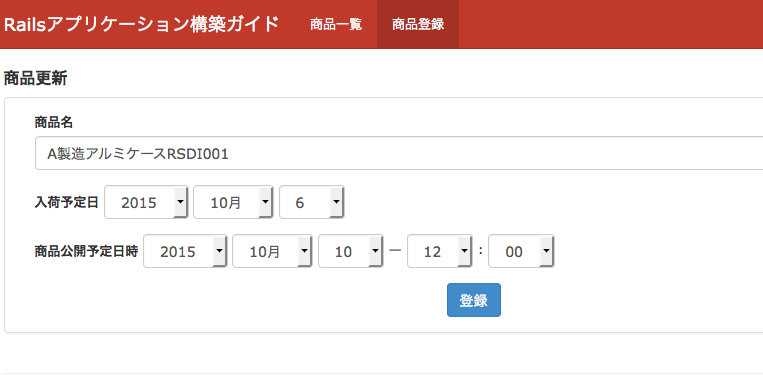
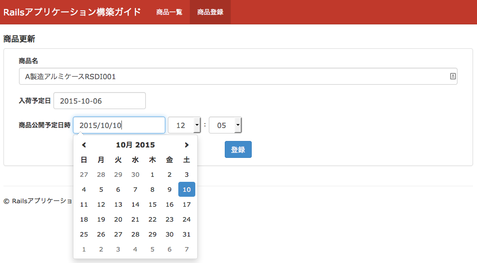
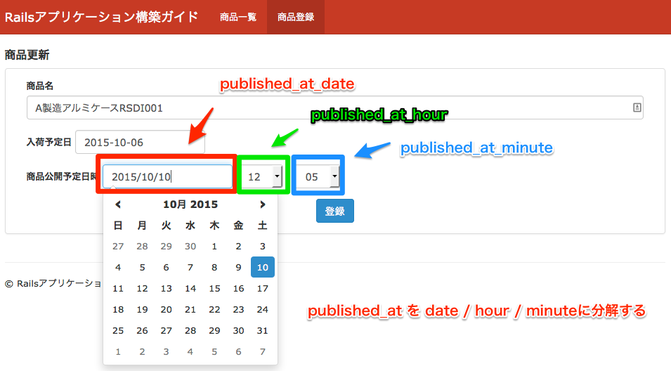

============================================================================
日付、時刻を登録可能なフォーム
============================================================================

課題: 商品の入荷予定日と公開予定時刻を登録可能なフォームの実装
============================================================================

日付、時刻(日時分）を登録する方法について、商品の登録画面を例に検討します。

商品登録画面では、商品の入荷予定日と公開予定日を登録可能です。
今回は、同じ画面を以下2つのパターンで実装する方法を考えてみます。

1. 日付、時刻をセレクトボックスで選ばせる
2. 日付のみカレンダーから選ばせ、時刻はセレクトボックスで選ばせる

  パターン1: 日付をセレクトボックスで選ばせる画面

  パターン2: 日付をカレンダーで、時刻をセレクトボックスで選ばせる画面

商品(Product)モデルは以下の通りです。

.. code-block:: ruby

  # == Schema Information
  #
  # Table name: products # 商品
  #
  #  id           :integer          not null, primary key
  #  name         :string(50)       not null              # 商品名
  #  arrival_date :date             not null              # 入荷予定日
  #  published_at :datetime         not null              # 公開予定日時
  #  created_at   :datetime         not null
  #  updated_at   :datetime         not null
  #

  class Product < ActiveRecord::Base
    validates :name, presence: true, length: { maximum: 50 }
    validates :arrival_date, presence: true
    validates :published_at , presence: true
  end

日付、時刻をセレクトボックスで選択する方法
============================================================================

Viewにて日付、時刻をセレクトボックス形式で表示するためには、
date_select / datetime_select を利用します。

.. code-block:: erb

  # app/views/products/new.html.erb (一部抜粋)
  # edit.html.erb も同じ

  <%= form_for(@product, url: path, method: method) do |f| %>
    <label class="control-label" for="">商品名</label>
    <%= f.text_field :name, class: 'form-control' %>

    <label class="control-label" for="">入荷予定日</label>
    <%= f.date_select :arrival_date, {}, class: 'form-control' %>

    <label class="control-label" for="">商品公開予定日時</label>
    <%= f.datetime_select :published_at, {}, class: 'form-control' %>

    <%= f.submit '登録', class: 'btn btn-primary' %>
  <% end %>

Controllerの実装は以下の通りです。

.. code-block:: ruby

  # app/controllers/products_controller.rb

  class ProductsController < ApplicationController
    def new
      @product = Form::Product.new
    end

    def create
      @product = Form::Product.new(product_params)
      if @product.save
        redirect_to products_path, notice: "商品 #{@product.name} を登録しました。"
      else
        render :new
      end
    end

    private

    def product_params
      params
        .require(:form_product)
        .permit(Form::Product::REGISTRABLE_ATTRIBUTES)
    end
  end

.. code-block:: ruby

  # app/models/form/product.rb

  class Form::Product < Product
    REGISTRABLE_ATTRIBUTES = %i(
      name
      arrival_date(1i) arrival_date(2i) arrival_date(3i)
      published_at(1i) published_at(2i) published_at(3i) published_at(4i) published_at(5i)
    )
  end

Viewでdate_select / datetime_selectを利用すると、Controller側には以下の形式でパラメータが渡されます。

.. code-block:: ruby

 # paramsで渡される値
 "form_product"=>
  {"name"=>"",
   "arrival_date(1i)"=>"2014",
   "arrival_date(2i)"=>"11",
   "arrival_date(3i)"=>"8",
   "published_at(1i)"=>"2014",
   "published_at(2i)"=>"11",
   "published_at(3i)"=>"8",
   "published_at(4i)"=>"10",
   "published_at(5i)"=>"18"},

変数名 + 1i, 2i, 3i には、年、月、日が入ります。
4i, 5i には時、分が入ります。
このパラメータをそのままProductモデルに入れることにより、日付・時刻の更新が可能です。

日付のみカレンダーから選ばせ、時刻はセレクトボックスで選ばせる方法
============================================================================

日付の選択を、JQuery UIの Datepicker(http://jqueryui.com/datepicker/) で選ばせたい、という要望もあるかと思います。
Twitter Bootstrapをお使いの方は、
bootstrap3-datetimepicker-rails(https://github.com/TrevorS/bootstrap3-datetimepicker-rails)
を導入することで、 手軽にDatepicker, DatetimePickerを利用できます。

日付の選択にDatepickerを利用する場合、Viewの実装は以下のようになります。

.. code-block:: erb

  # app/views/products/new.html.erb (一部抜粋)
  <%= form_for(@product, url: path, method: method) do |f| %>
    # 略

    <label class="control-label" for="">入荷予定日</label>
    <%= f.text_field :arrival_date, class: 'form-control date-picker' %>

    # 略
  <% end %>

.. code-block:: javascript

  # app/assets/javascript/application.js.coffee などで以下実装

  $('.date-picker').datetimepicker(pickTime: false);

Controller側に渡されるパラメータは、以下のようになります。

.. code-block:: ruby

  => {"utf8"=>"✓",
 "form_product"=>{"name"=>"", "arrival_date"=>"2014/11/08"},
 "action"=>"create",
 "controller"=>"products"}

日付情報が文字列として渡されてくるため、
単にパラメータの値をProductのattributesに入れるだけで
日付の更新が可能です。

日付のみDatepickerを利用し、時刻情報をセレクトボックスで選びたい、という要望があった場合、
どのように実装したらよいでしょうか。

.. note::

  TwitterBootstrapを利用しているのなら、bootstrap3-datetimepicker-railsを導入することで、
  日付、時刻とも設定可能なDatetimePickerというウィジェットが利用可能です。

方法はいろいろ考えられますが、published_atを例に、今回は以下戦略で実装することとします。

- published_at (datetime型) を、Productモデル側で以下3つの変数に分解する

  - published_at_date
  - published_at_hour
  - published_at_minute

- Viewでは、上記3つの値を設定可能にする
- 保存直前に、published_at_date / hour / minute を一つにまとめ、published_at に保存する

  日時分を3つの変数に分解して設定する

Datetime側を3つの変数(date / hour / minute) に分解するため、
以下ライブラリを concerns に配置します。

.. include:: codes/datetime_integratable.rst

Form::Productモデルで、以下のように宣言を行います。

.. code-block:: ruby

  # app/models/form/product.rb

  class Form::Product < Product
    include DatetimeIntegratable

    REGISTRABLE_ATTRIBUTES = %i(
      name
      arrival_date
      published_at_date published_at_hour published_at_minute
    )

    # DatetimeIntegratableで宣言した、 integrate_datetime_fields関数を利用
    # 下記のように宣言することで、モデル初期化時にpublished_atを
    # published_at_date, published_at_hour, published_at_minute に分解する
    #
    # モデル保存時に、date/hour/minute の3つの変数の値を
    # published_at に戻す
    integrate_datetime_fields :published_at

    validates :published_at_date, presence: true
    validates :published_at_hour, presence: true
    validates :published_at_minute, presence: true
  end

Controller, Viewの実装は、以下の通りです。

.. code-block:: ruby

  # app/controller/products_controller.rb

  class ProductsController < ApplicationController
    def new
      @product = Form::Product.new
    end

    def create
      @product = Form::Product.new(product_params)
      if @product.save
        redirect_to products_path, notice: "商品 #{@product.name} を登録しました。"
      else
        render :new
      end
    end

    private

    def product_params
      params
        .require(:form_product)
        .permit(Form::Product::REGISTRABLE_ATTRIBUTES)
    end
  end

.. code-block:: erb

  # app/views/products/new.html.erb (一部抜粋)

  <%= form_for(@product, url: path, method: method) do |f| %>
    

      <label class="control-label" for="">商品名</label>
      <%= f.text_field :name, class: 'form-control' %>
    

    

      <label class="control-label" for="">入荷予定日</label>
      <%= f.text_field :arrival_date, class: 'form-control date-picker' %>
    

    

      <label class="control-label" for="">商品公開予定日時</label>
      <%= f.text_field :published_at_date, class: 'form-control date-picker' %>
      <%= f.select :published_at_hour, (0..23).to_a.map { |v| "%02d" % v }, {}, class: 'form-control' %> :
      <%= f.select :published_at_minute, (0..59).to_a.map { |v| "%02d" % v }, {}, class: 'form-control' %>
    

    <%= f.submit '登録', class: 'btn btn-primary' %>
  <% end %>

ViewからControllerに渡るパラメータは、以下のようになります。

.. code-block:: ruby

  [1] pry(#<ProductsController>)> params
  => {"utf8"=>"✓",
   "authenticity_token"=>"Uac8r+KWhNq8ohPWJtAUYglXwpNGDyHnwPr64TP8R+0=",
   "form_product"=>{"name"=>"", "arrival_date"=>"2014/11/08", "published_at_date"=>"2014/11/08",
                    "published_at_hour"=>"15", "published_at_minute"=>"10"},
   "commit"=>"登録",
   "action"=>"create",
   "controller"=>"products"}

サンプルアプリケーション
============================================================================

今回実装したサンプルアプリケーションは、以下ページにて取得可能です。

- セレクトボックスを利用した実装

  - https://github.com/Rails-Application-Build-Guides/rails-application-build-guide-sample/tree/master/form/datetime_forms

- DatePickerを利用した実装

  - https://github.com/Rails-Application-Build-Guides/rails-application-build-guide-sample/tree/master/form/datetime_js_forms
