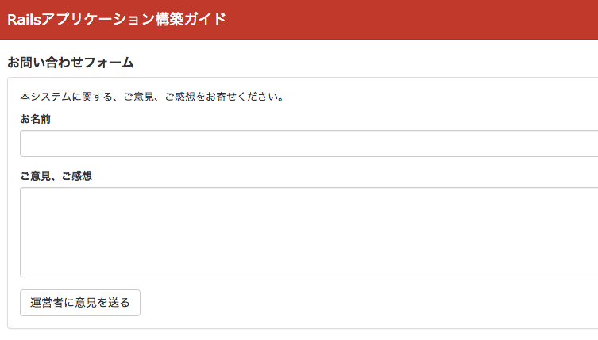
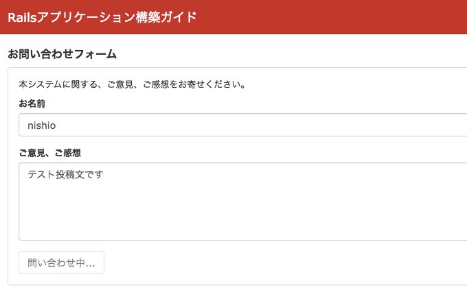

============================================================================
二重投稿の防止
============================================================================

課題: 問い合わせフォームの実装
============================================================================

単純な問い合わせフォームの実装を考えてみます。

問い合わせフォームでは、システム利用者が運営管理者に対して、意見を送ることができます。
画面イメージは以下の通りです。

  問い合わせフォーム

「運営者に意見を送る」ボタンをクリックすると、DBに問い合わせフォームの内容が保存されます。
システムによっては、ボタン押下のタイミングで運営管理者に対してメールを送る、
などの実装も考えられます。

ここで一つ問題が発生しました。
ユーザが意見を送るボタンを連打すると、問い合わせが何度も実行されてしまいます。

問い合わせが何度も行われてしまうと、DBに重複したデータが登録されてしまいます。
場合によっては、メールが何通も飛んでしまったり、サーバに無駄な負荷がかかってしまいます。

Javascriptでサーバの二重投稿を防止する
============================================================================

二重投稿を防止するには、「運営者に意見を送る」ボタンを押下後、
ボタンをDisabled状態にします。
この機能を実現するためには、disabled_with を利用します。

Viewの実装は以下のようになります。

.. code-block:: erb

  # app/views/contacts/new.html.erb (一部抜粋)

  <h1>お問い合わせフォーム</h1>

  <%= form_for(@contact, method: :post) do |f| %>
  
本システムに関する、ご意見、ご感想をお寄せください。

  

    <label class="control-label" for="">お名前</label>
    <%= f.text_field :name, class: 'form-control' %>
  

  

    <label class="control-label" for="">ご意見、ご感想</label>
    <%= f.text_area :content, rows: 5, class: 'form-control' %>
  

  <%= f.submit '運営者に意見を送る', class: 'btn btn-default',
      data: { disable_with: '問い合わせ中...' } %>
  <% end %>

submitボタンに ``data: { disabled_with: 'ボタン押下後の文言' }`` を記述することで、
投稿ボタン押下後に、ボタンが以下のように変化します。

  問い合わせフォーム・意見を送るボタン押下後にボタンがdisabled状態となる

サンプルアプリケーション
============================================================================

今回実装したサンプルアプリケーションは、以下ページにて取得可能です。

- https://github.com/Rails-Application-Build-Guides/rails-application-build-guide-sample/tree/master/form/double_submit_protection

  - 開発環境(RAILS_ENV=development)で二重投稿を再現するためには、サーバ起動に exec_server.sh スクリプトを利用してください
