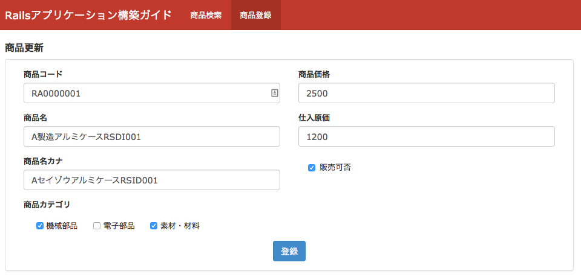

============================================================================
多対多の関連を持つオブジェクトをチェックボックスで編集可能なフォーム
============================================================================

課題: 商品登録画面の実装
============================================================================

多対多の関連を持つオブジェクトの編集画面について、
販売管理システムの商品登録画面を例に考えてみます。

商品登録画面では、商品に関する基本情報と商品カテゴリを登録可能です。
画面のイメージは下図の通りです。

  販売管理システム - 商品登録画面

