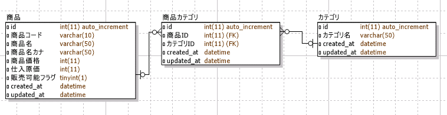

============================================================================
多対多の関連を持つオブジェクトをチェックボックスで編集可能なフォーム
============================================================================

課題: 商品登録画面の実装
============================================================================

多対多の関連を持つオブジェクトの編集画面について、
販売管理システムの商品登録画面を例に考えてみます。

商品登録画面では、商品に関する基本情報と商品カテゴリを登録可能です。
画面のイメージは下図の通りです。

.. figure:: images/habtm_checkbox_form.png
  :scale: 80%

  販売管理システム - 商品登録画面

今回のサンプルは、 :ref:`many_to_many_object_registrable_form` の課題と
実現したいことは同じです。
商品カテゴリの選択がプルダウン形式のセレクトボックスからチェックボックスに変わっています。

DB設計は以下の通りです。

  販売管理システムDB設計 - ER図

モデル、システム要件、に関しては
:ref:`many_to_many_object_registrable_form` と全く同じのため省略いたします。

多対多の関連をチェックボックスで登録する方法
============================================================================

