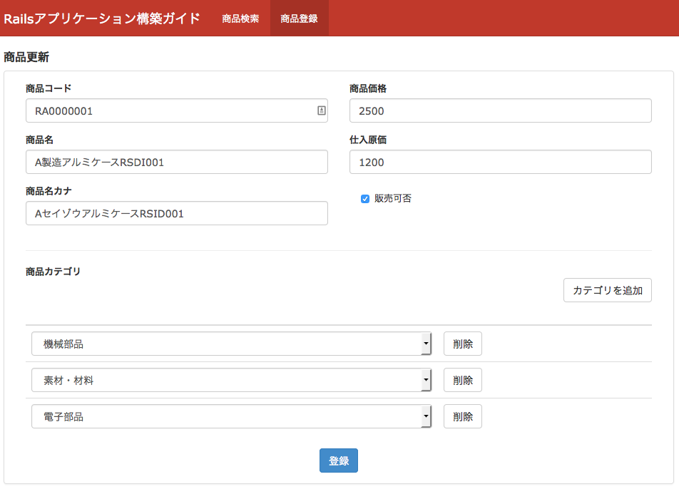
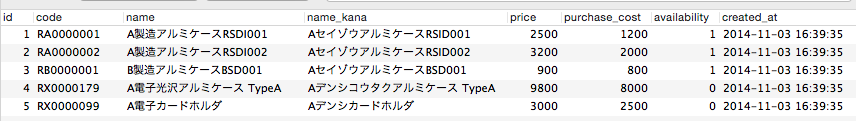
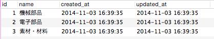

.. _many_to_many_object_registrable_form:

============================================================================
多対多の関連を持つオブジェクトを編集可能なフォーム
============================================================================

課題: 商品登録画面の実装
============================================================================

多対多の関連を持つオブジェクトの編集画面について、
販売管理システムの商品登録画面を例に考えてみます。

商品登録画面では、商品に関する基本情報と商品カテゴリを登録可能です。
画面のイメージは下図の通りです。

  販売管理システム - 商品登録画面

商品にはカテゴリ情報を付与することができます。
カテゴリを追加ボタンを押すことで、商品に関連するカテゴリをいくつでも設定可能です。
また、不要なカテゴリは削除ボタンを押すことで削除可能です。

システムはproducts(商品)テーブルと、categories(カテゴリ)テーブル、
product_categories(商品カテゴリ)テーブルを持ちます。
商品とカテゴリは多対多の関連にあり、中間テーブルとして商品カテゴリテーブルを持ちます。

DB設計は以下の通りです。

.. figure:: images/mtm_db_er.png
  :scale: 80%

  販売管理システムDB設計 - ER図

Productモデルは以下の通りです。

.. code-block:: ruby

  # == Schema Information
  #
  # Table name: products # 商品
  #
  #  id            :integer          not null, primary key
  #  code          :string(10)       not null              # 商品コード
  #  name          :string(50)       not null              # 商品名
  #  name_kana     :string(50)       default(""), not null # 商品名カナ
  #  price         :integer          not null              # 商品価格
  #  purchase_cost :integer          not null              # 仕入原価
  #  availability  :boolean          not null              # 販売可能フラグ
  #  created_at    :datetime         not null
  #  updated_at    :datetime         not null
  #

  class Product < ActiveRecord::Base
    has_many :product_categories
    has_many :categories, through: :product_categories
    accepts_nested_attributes_for :product_categories, allow_destroy: true

    validates :code, presence: true, length: { maximum: 10 }
    validates :name, presence: true, length: { maximum: 50 }
    validates :name_kana, kana: true, length: { maximum: 50 }
    validates :price,
               presence: true,
               numericality: { only_integer: true, greater_than_or_equal_to: 0 }
    validates :purchase_cost,
               presence: true,
              numericality: { only_integer: true, greater_than_or_equal_to: 0 }
    validates :availability, inclusion: { in: [true, false] }
  end

Categoryモデルは以下の通りです。

.. code-block:: ruby

  # == Schema Information
  #
  # Table name: categories # カテゴリ
  #
  #  id         :integer          not null, primary key
  #  name       :string(50)       not null              # カテゴリ名
  #  created_at :datetime         not null
  #  updated_at :datetime         not null
  #

  class Category < ActiveRecord::Base
    has_many :product_categories
    has_many :products, through: :product_categories
  end

ProductCategoryモデルは以下の通りです。

.. code-block:: ruby

  # == Schema Information
  #
  # Table name: product_categories # 商品カテゴリ
  #
  #  id          :integer          not null, primary key
  #  product_id  :integer          not null              # 商品ID
  #  category_id :integer          not null              # カテゴリID
  #  created_at  :datetime         not null
  #  updated_at  :datetime         not null
  #

  class ProductCategory < ActiveRecord::Base
    belongs_to :product
    belongs_to :category
  end

商品、カテゴリ、商品カテゴリのデータサンプルは、以下の通りです。

  商品(Product)のサンプルデータ

  カテゴリ(Category)のサンプルデータ

.. figure:: images/mtm_data_sample_product_category.png
  :scale: 80%

  商品カテゴリ(ProductCategory)のサンプルデータ

システム要件は以下の通りです。

- 商品登録画面では、以下情報が登録可能なこと

  - 以下商品情報が登録可能なこと

    - コード、商品名、商品名カナ、商品価格、仕入原価、販売可否フラグ

  - 商品に紐づくカテゴリが登録可能なこと

    - カテゴリはカテゴリテーブル内にあるデータのみ登録可能なこと

  - カテゴリは複数登録可能なこと
  - 商品、商品カテゴリの編集が可能なこと

    - 商品に紐づく紐づくカテゴリは編集画面で削除できること

多対多の関連を持つ商品登録画面の実装方法
============================================================================

多対多の関連を持つオブジェクトを編集できるフォームの実装も、
:ref:`form_one_to_many_relation` とほとんど変わりません。

以下、商品と商品カテゴリのフォームオブジェクトを作成します。

.. code-block:: ruby

  # app/models/form/product.rb
  class Form::Product < Product
    REGISTRABLE_ATTRIBUTES = %i(code name name_kana price purchase_cost availability)

    has_many :product_categories, class_name: 'Form::ProductCategory'
  end

.. code-block:: ruby

  # app/models/form/product_category.rb
  class Form::ProductCategory < ProductCategory
    REGISTRABLE_ATTRIBUTES = %i(id product_id category_id _destroy)

    def selectable_categories
      Category.all
    end
  end

コントローラの実装は以下の通りです。

.. code-block:: ruby

  # app/controllers/products_controller.rb
  class ProductsController < ApplicationController
    def new
      @product = Form::Product.new
    end

    def edit
      @product = Form::Product.find(params[:id])
    end

    def create
      @product = Form::Product.new(product_params)
      if @product.save
        redirect_to products_path, notice: "商品 #{@product.name} を登録しました。"
      else
        render :new
      end
    end

    def update
      @product = Form::Product.find(params[:id])
      if @product.update_attributes(product_params)
        redirect_to products_path, notice: "商品 #{@product.name} を更新しました。"
      else
        render :edit
      end
    end

    private

    def product_params
      params
        .require(:form_product)
        .permit(
          Form::Product::REGISTRABLE_ATTRIBUTES +
          [product_categories_attributes: Form::ProductCategory::REGISTRABLE_ATTRIBUTES]
        )
    end
  end

Viewの実装は以下の通りです。

.. code-block:: erb

  # app/views/products/new.html.erb (一部抜粋)
  # edit.html.erb もpath以外は同じ

  <%= form_for(@product, url: path, method: method) do |f| %>
    

    

      <label class="control-label" for="">商品コード</label>
      <%= f.text_field :code, class: 'form-control' %>
    

    

      <label class="control-label" for="">商品名</label>
      <%= f.text_field :name, class: 'form-control' %>
    

    

      <label class="control-label" for="">商品名カナ</label>
      <%= f.text_field :name_kana, class: 'form-control' %>
    

    

    

    

      <label class="control-label" for="">商品価格</label>
      <%= f.text_field :price, class: 'form-control' %>
    

    

      <label class="control-label" for="">仕入原価</label>
      <%= f.text_field :purchase_cost, class: 'form-control' %>
    

    

      

      

        <label>
          <%= f.check_box :availability, {}, 'true', 'false' %>
          販売可否
        </label>
      

      

    

    

    

      

      <b>商品カテゴリ</b>
      

        <%= link_to_add_association 'カテゴリを追加', f, :product_categories,
          class: 'btn btn-default',
          data: {
            association_insertion_node: '#detail-association-insertion-point',
            association_insertion_method: 'append' }
         %>
      

      <table class="table table-list">
      <thead>
        <tr>
          <th></th>
          <th></th>
        </tr>
      </thead>

      <tbody id='detail-association-insertion-point'>
      

      <%= f.fields_for :product_categories do |od| %>
        <%= render 'product_category_fields', f: od %>
      <% end %>
      

      </tbody>
      </table>
    

    

    

    <%= f.submit '登録', class: 'btn btn-primary' %>
    

    

  <% end %>

.. code-block:: ruby

  # app/views/products/_product_category_fields.html.erb 
  <tr class="nested-fields">
    <%= f.hidden_field :id %>
    <td>
    <%= f.collection_select :category_id, f.object.selectable_categories, :id, :name, {}, class: 'form-control' %>
    </td>
    <td>
    <%= link_to_remove_association '削除', f, class: 'btn btn-default' %>
    </td>
  </tr>

カテゴリを追加ボタンで、商品に紐づくカテゴリを動的に追加可能です。
動的にフォームの要素を追加する方法については、 :ref:`form_one_to_many_relation` を
参照してください。

Viewのfields_for に指定する要素は categories ではなく product_categories です。
商品とカテゴリは多対多の関連を持っていますが、
実際に編集するのは1対多の関連にある商品と商品カテゴリのみです。
よって、:ref:`form_one_to_many_relation` の実装と変わりはありません。

サンプルアプリケーション
============================================================================

今回実装したサンプルアプリケーションは、以下ページにて取得可能です。

- https://github.com/Rails-Application-Build-Guides/rails-application-build-guide-sample/tree/master/form/many_to_many_forms
