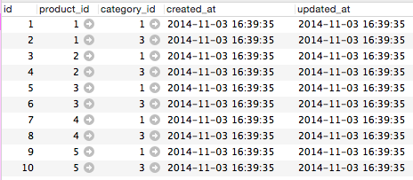

.. _many_to_many_object_registrable_form:

============================================================================
多対多の関連を持つオブジェクトを編集可能なフォーム
============================================================================

課題: 商品登録画面の実装
============================================================================

多対多の関連を持つオブジェクトの編集画面について、
販売管理システムの商品登録画面を例に考えてみます。

商品登録画面では、商品に関する基本情報と商品カテゴリを登録可能です。
画面のイメージは下図の通りです。

  販売管理システム - 商品登録画面

商品にはカテゴリ情報を付与することができます。
カテゴリを追加ボタンを押すことで、商品に関連するカテゴリをいくつでも設定可能です。
また、不要なカテゴリは削除ボタンを押すことで削除可能です。

システムはproducts(商品)テーブルと、categories(カテゴリ)テーブル、
product_categories(商品カテゴリ)テーブルを持ちます。
商品とカテゴリは多対多の関連にあり、中間テーブルとして商品カテゴリテーブルを持ちます。

DB設計は以下の通りです。

.. figure:: images/mtm_db_er.png
  :scale: 80%

  販売管理システムDB設計 - ER図

Productモデルは以下の通りです。

.. code-block:: ruby

  # == Schema Information
  #
  # Table name: products # 商品
  #
  #  id            :integer          not null, primary key
  #  code          :string(10)       not null              # 商品コード
  #  name          :string(50)       not null              # 商品名
  #  name_kana     :string(50)       default(""), not null # 商品名カナ
  #  price         :integer          not null              # 商品価格
  #  purchase_cost :integer          not null              # 仕入原価
  #  availability  :boolean          not null              # 販売可能フラグ
  #  created_at    :datetime         not null
  #  updated_at    :datetime         not null
  #

  class Product < ActiveRecord::Base
    has_many :product_categories
    has_many :categories, through: :product_categories
    accepts_nested_attributes_for :product_categories, allow_destroy: true

    validates :code, presence: true, length: { maximum: 10 }
    validates :name, presence: true, length: { maximum: 50 }
    validates :name_kana, kana: true, length: { maximum: 50 }
    validates :price,
               presence: true,
               numericality: { only_integer: true, greater_than_or_equal_to: 0 }
    validates :purchase_cost,
               presence: true,
              numericality: { only_integer: true, greater_than_or_equal_to: 0 }
    validates :availability, inclusion: { in: [true, false] }
  end

Categoryモデルは以下の通りです。

.. code-block:: ruby

  # == Schema Information
  #
  # Table name: categories # カテゴリ
  #
  #  id         :integer          not null, primary key
  #  name       :string(50)       not null              # カテゴリ名
  #  created_at :datetime         not null
  #  updated_at :datetime         not null
  #

  class Category < ActiveRecord::Base
    has_many :product_categories
    has_many :products, through: :product_categories
  end

ProductCategoryモデルは以下の通りです。

.. code-block:: ruby

  # == Schema Information
  #
  # Table name: product_categories # 商品カテゴリ
  #
  #  id          :integer          not null, primary key
  #  product_id  :integer          not null              # 商品ID
  #  category_id :integer          not null              # カテゴリID
  #  created_at  :datetime         not null
  #  updated_at  :datetime         not null
  #

  class ProductCategory < ActiveRecord::Base
    belongs_to :product
    belongs_to :category
  end

商品、カテゴリ、商品カテゴリのデータサンプルは、以下の通りです。

  商品(Product)のサンプルデータ

.. figure:: images/mtm_data_sample_category.png
  :scale: 80%

  カテゴリ(Category)のサンプルデータ

  商品カテゴリ(ProductCategory)のサンプルデータ

システム要件は以下の通りです。

- 商品登録画面では、以下情報が登録可能なこと

  - 以下商品情報が登録可能なこと

    - コード、商品名、商品名カナ、商品価格、仕入原価、販売可否フラグ

  - 商品に紐づくカテゴリが登録可能なこと

    - カテゴリはカテゴリテーブル内にあるデータのみ登録可能なこと

  - カテゴリは複数登録可能なこと
  - 商品、商品カテゴリの編集が可能なこと

    - 商品に紐づく紐づくカテゴリは編集画面で削除できること

.. note::

  この章は :ref:`form_one_to_many_relation` を読んでいることを前提として話を進めます。

11/04 今日はここまで
