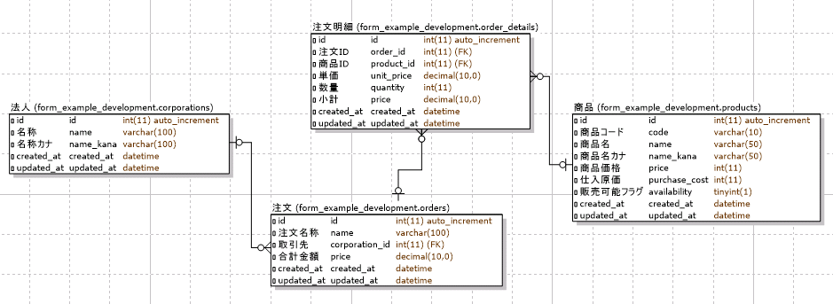

============================================================================
1対多の関連を持つオブジェクトを編集可能なフォーム
============================================================================

課題: 受注登録画面の実装
============================================================================

1対多の関連を持つオブジェクトの編集画面について、
販売管理システムの受注登録画面を例に考えてみます。

受注登録画面では、受注に関する基本情報(受注名称と取引先)と明細情報を登録可能です。
画面のイメージは下図の通りです。

  販売管理システム - 受注登録画面

明細を追加ボタンを押すことで、受注明細をいくつでも追加可能です。
不要な明細は削除ボタンを押すことで削除可能です。

システムはorders(注文)テーブルと、order_details(注文明細)テーブルを持ち、
注文と注文明細は1対多の関連を持ちます。

また、corporations(法人)テーブルとproducts(商品)テーブルも今回の販管システムでは持っています。
corporationsは注文と関連を持ち、productsは注文明細と関連を持ちます。

DB設計は以下の通りです。

  販売管理システムDB設計 - ER図

Orderモデルは以下の通りです。

.. code-block:: ruby

  # == Schema Information
  #
  # Table name: orders # 注文
  #
  #  id             :integer          not null, primary key
  #  name           :string(100)      not null              # 注文名称
  #  corporation_id :integer          not null              # 取引先
  #  price          :integer          not null              # 合計金額
  #  created_at     :datetime         not null
  #  updated_at     :datetime         not null
  #

  class Order < ActiveRecord::Base
    belongs_to :corporation
    has_many :order_details, dependent: :destroy
    has_many :products, through: :order_details

    accepts_nested_attributes_for :order_details, allow_destroy: true
  end

OrderDetailモデルは以下の通りです。

.. code-block:: ruby

  # == Schema Information
  #
  # Table name: order_details # 注文明細
  #
  #  id         :integer          not null, primary key
  #  order_id   :integer          not null              # 注文ID
  #  product_id :integer          not null              # 商品ID
  #  unit_price :integer          not null              # 単価
  #  quantity   :integer          not null              # 数量
  #  price      :integer          not null              # 小計
  #  created_at :datetime         not null
  #  updated_at :datetime         not null
  #

  class OrderDetail < ActiveRecord::Base
    belongs_to :order
    belongs_to :product
  end

Corporationモデル、Productモデルに関しては省略します。

注文、注文明細のデータサンプルは、以下の通りです。

  注文(Order)のサンプルデータ

  注文明細(OrderDetail)のサンプルデータ

受注データは新規登録だけでなく、編集もできる必要があります。
受注情報編集画面へは、受注一覧画面、編集ボタンから遷移可能とします。

  販売管理システム - 受注一覧

システム要件は以下の通りです。

- 受注登録画面では、以下情報が登録可能であること

  - 受注名称が登録可能であること
  - 取引先が登録可能であること

    - 取引先は法人(corporations)テーブルに存在するもののみ登録可能であること

  - 受注明細が登録可能であること

    - 受注明細は複数登録可能であること
    - 受注明細では以下情報が登録可能であること

      - 商品が登録可能であること

        - 商品は商品(products)テーブルに存在するもののみ登録可能であること

      - 単価が登録可能であること
      - 数量が登録可能であること

  - 受注明細小計は以下ルールに基づき計算し、注文明細テーブルに保存しておくこと

    - 単価 * 数量

  - 受注合計額は以下ルールに基づき計算し、注文テーブルに保存しておくこと

    - 紐づく受注明細の小計の合計額

1対多の関連を持つ受注登録画面の実装方法
============================================================================

今回の受注登録画面を実装は複雑なため、以下項目に分解して実装方法を検討していきます。

- 受注、受注明細のフォームオブジェクト作成
- 受注登録コントローラの実装
- 受注登録ビューの実装
- 動的に要素を増減可能な受注明細の実装

受注、受注明細のフォームオブジェクト作成
----------------------------------------------------------------------------

登録フォームを作成する際は、FatController, FatModelを回避するために
登録専用のフォームオブジェクトを作成することをお勧めします。

今回の受注登録画面で必要となる、受注、受注明細のフォームオブジェクトは以下の通りです。

.. code-block:: ruby

  # app/models/form/order.rb

  class Form::Order < Order
    REGISTRABLE_ATTRIBUTES = %i(name corporation_id price)
    has_many :order_details, class_name: 'Form::OrderDetail'

    after_initialize { order_details.build unless self.persisted? || order_details.present? }
    before_validation :calculate_order_price

    def selectable_corporations
      Corporation.all
    end

    private

    def calculate_order_price
      order_details.each(&:calculate_order_detail_price)
      self.price = order_details.map(&:price).sum
    end
  end

.. code-block:: ruby

  # app/models/form/order_detail.rb

  class Form::OrderDetail < OrderDetail
    REGISTRABLE_ATTRIBUTES = %i(id product_id unit_price quantity _destroy)

    def selectable_products
      Product.all
    end

    def calculate_order_detail_price
      self.price = unit_price * quantity
    rescue
      self.price = 0
    end
  end

受注登録コントローラの実装
----------------------------------------------------------------------------

受注登録のコントローラ実装は以下の通りです。
重要なことは、できるだけコントローラ層に処理を書かない、ということです。

.. code-block:: ruby

  # app/controller/orders_controller.rb

  class OrdersController < ApplicationController
    before_action :set_order, only: [:edit, :update]

    def index
      @q = Order.search
    end

    def search
      @q = Order.search(search_params)
      @orders = @q.result.preload(:corporation)
    end

    def new
      @order = Form::Order.new
    end

    def edit
      @order = Form::Order.find(params[:id])
    end

    def create
      @order = Form::Order.new(order_params)
      if @order.save
        redirect_to orders_path, notice: "受注 #{@order.name} を登録しました。"
      else
        render :new
      end
    end

    def update
      if @order.update_attributes(order_params)
        redirect_to orders_path, notice: "受注 #{@order.name} を更新しました。"
      else
        render :edit
      end
    end

    def destroy
      Order.find(params[:id]).destroy
      redirect_to orders_url, notice: '受注を削除しました。'
    end

    private

    def set_order
      @order = Form::Order.find(params[:id])
    end

    def search_params
      search_conditions = %i(
        name_cont corporation_name_cont price_gteq price_lteq
      )
      params.require(:q).permit(search_conditions)
    end

    def order_params
      params
        .require(:form_order)
        .permit(
          Form::Order::REGISTRABLE_ATTRIBUTES +
          [order_details_attributes: Form::OrderDetail::REGISTRABLE_ATTRIBUTES]
        )
    end
  end

受注登録のビューの実装
----------------------------------------------------------------------------

受注登録画面のViewの実装は以下の通りです。

.. code-block:: ruby

  # app/views/products/new.html.erb
  # (edit.html.erb もpost先が違うのみで、他の実装は同じ)

  <% content_for(:title) do %>
    受注登録
  <% end %>

  <%= render 'form', path: orders_path, method: :post %>

.. code-block:: erb

  # app/views/products/_form.html.erb (細かなタグは省略)

  <%= form_for(@order, url: path, method: method) do |f| %>
    <label class="control-label" for="">受注名称</label>
    <%= f.text_field :name, class: 'form-control' %>

    <label class="control-label" for="">取引先</label>
    <%= f.collection_select :corporation_id, f.object.selectable_corporations, :id, :name, {}, class: 'form-control' %>

    <b>受注明細</b>
    

      <%= link_to_add_association '明細を追加', f, :order_details,
        class: 'btn btn-default',
        data: {
          association_insertion_node: '#detail-association-insertion-point',
          association_insertion_method: 'append' }
       %>
    

    <table class="table table-list">
    <thead>
      <tr>
        <th>商品</th>
        <th>単価</th>
        <th>数量</th>
        <th>小計</th>
        <th></th>
      </tr>
    </thead>

    <tbody id='detail-association-insertion-point'>
    

    <%= f.fields_for :order_details do |od| %>
      <%= render 'order_detail_fields', f: od %>
    <% end %>
    

    </tbody>
    </table>

    <label class="control-label" for="">受注額合計</label>
    <%= f.text_field :price, class: 'form-control total',
        disabled: true,
        value: number_to_currency(f.object.price) %>

    <%= f.submit '登録', class: 'btn btn-primary' %>
  <% end %>

.. code-block:: ruby

  # app/views/products/_order_detail_fields.html.erb

  <tr class="nested-fields">
    <%= f.hidden_field :id %>
    <td>
    <%= f.collection_select :product_id, f.object.selectable_products, :id, :name, {}, class: 'form-control' %>
    </td>
    <td>
    <%= f.text_field :unit_price, class: 'form-control unit-price' %>
    </td>
    <td>
    <%= f.text_field :quantity, class: 'form-control quantity' %>
    </td>
    <td>
    <%= f.text_field :price, class: 'form-control subtotal', disabled: true %>
    </td>
    <td>
    <%= link_to_remove_association '削除', f, class: 'btn btn-default' %>
    </td>
  </tr>

注文フォームで注文明細を編集するために、fields_forメソッドを利用しています。

ここでfields_forメソッドについて補足しておきます。
fields_forは自モデルとは異なるオブジェクトを編集する際に利用するメソッドです。
今回のサンプルでform_forに渡しているモデルはForm::Orderモデルですが、
あわせてForm::OrderDetailオブジェクトも編集する必要があります。
その際に利用するのが、fields_forメソッドです。

fields_for を利用するためには、以下条件を満たす必要があります。

- fields_for の第一引数に渡した変数名の変数にアクセスできること
- 指定した変数が ``xxx_attributes=`` (xxx は変数名)という形式で更新できること

Orderモデルは ``has_many :order_details`` と宣言しているため、order_details変数にはアクセス可能であり、
一つ目の条件は満たしています。

二つ目の条件 ``order_details_attributes=`` で注文明細を編集できるようにする、を満たすためには、
``accepts_nested_attributes_for`` 関数を利用します。Orderモデルに、

.. code-block:: ruby

  accepts_nested_attributes_for :order_details, allow_destroy: true

と宣言することにより、 ``Order.new.order_details_attributes=`` 関数で
Orderの関連であるOrderDetailモデルを編集できるようになります。

``allow_destroy: true`` と宣言することにより、関連の削除が可能となります。
``allow_destroy`` 指定で order_detailsのモデルに ``_destroy`` という変数が追加されます。
この変数に ``true`` を入れることにより、
モデル保存時に関連である order_details が削除されるようになります。

以下は注文、注文明細更新時にControllerに引き渡されるパラメータのサンプルです。

.. code-block:: ruby

  # app/controller/orders_controller.rb#update で受け取るparamsのサンプル
  "form_order"=>
   {"name"=>"A機械製造1031注文",
    "corporation_id"=>"1",
    "order_details_attributes"=>
       {"0"=>{"id"=>"1", "product_id"=>"1", "unit_price"=>"2000", "quantity"=>"3", "_destroy"=>"false"},
        "1"=>{"id"=>"2", "product_id"=>"4", "unit_price"=>"10000", "quantity"=>"4", "_destroy"=>"false"}
       }
   }

上記パラメータをOrderモデルに引き渡すことで、注文、注文明細を更新することが可能です。

.. code-block:: ruby

  # 注文、注文明細を新規作成
  @order = Form::Order.new(params[:form_order])

  # 注文、注文明細を更新
  @order.update_attributes(params[:form_order])

動的に要素を増減可能な受注明細の実装
----------------------------------------------------------------------------

注文明細フォームを動的に追加、削除するには、JavaScriptにてフォームの追加、削除を行う必要があります。

  受注明細を動的に追加する

明細削除の際は、単に領域を削除してはいけません。
指定した受注明細を消すために、_destroyとid のペアを
パラメータとしてコントローラに渡してあげる必要があるからです。

動的に要素を増減可能なフォームをJavascriptで1から実装するのは、なかなか手間のかかるものです。
Javascriptに自信のある方はフルスクラッチで作成するのも良いですが、
そうでない方は外部のgemを利用することをおすすめします。

動的に要素を増減可能なフォームを実現するためのgemはいくつかありますが、
今回はcocoon(https://github.com/nathanvda/cocoon) というgemを利用することとします。

cocoonは以下規則に従うことで、指定した領域を動的に追加、削除することが可能となります。

**1. 動的に要素を増減したいfields_forの領域を _xxx_fields.html.erb に切り出す**

.. code-block:: ruby

  # app/views/orders/_form.html
  <tbody id='detail-association-insertion-point'>
  

  <%= f.fields_for :order_details do |od| %>
    <%= render 'order_detail_fields', f: od %>
  <% end %>

  

  </tbody>

xxx にはfields_for で指定した変数名が入ります。
今回のサンプルですと、fields_for には ``order_details`` を指定しているので、
``_order_detail_fields.html.erb`` というpartialファイルにビューを切り出します。

**2. _fields.html.erb内の要素を増減したい領域に、class='nested-fields'をつける**

.. code-block:: ruby

  # app/views/products/_order_detail_fields.html.erb

  <tr class="nested-fields">
    <%= f.hidden_field :id %>
    <td>
    <%= f.collection_select :product_id, f.object.selectable_products, :id, :name, {}, class: 'form-control' %>
    </td>
    <td>
    <%= f.text_field :unit_price, class: 'form-control unit-price' %>
    </td>
    <td>
    <%= f.text_field :quantity, class: 'form-control quantity' %>
    </td>
    <td>
    <%= f.text_field :price, class: 'form-control subtotal', disabled: true %>
    </td>
    <td>
    <%= link_to_remove_association '削除', f, class: 'btn btn-default' %>
    </td>
  </tr>

cocoonは、nested-fields内に存在する要素をコピーすることにより、対象領域を動的に追加しています。

**3. nested-fieldsの領域を追加するには、link_to_add_associationヘルパーを利用する**

.. code-block:: ruby

  # app/views/proudcts/_form.html.erb

  <%= link_to_add_association '明細を追加', f, :order_details,
    class: 'btn btn-default',
    data: {
      association_insertion_node: '#detail-association-insertion-point',
      association_insertion_method: 'append' }
   %>

``link_to_add_association`` を利用することで、fields_for内の要素を
追加するためのリンクが生成可能です。
data-association-insertion-nodeや、data-association-insertion-method を指定することで、
コピーした領域をどこに挿入するかを細かく設定することが可能です。

**4. nested-fieldsの領域を削除するには、link_to_remove_associationヘルパーを利用する**

.. code-block:: ruby

  <%= link_to_remove_association '削除', f, class: 'btn btn-default' %>

上記のステップを踏むだけで、要素を動的に増減可能なフォームを手軽に実装することができます。

サンプルアプリケーション
============================================================================

今回実装したサンプルアプリケーションは、以下ページにて取得可能です。

- https://github.com/nishio-dens/rails-application-build-guide-sample/tree/master/form/dynamic_nested_forms
