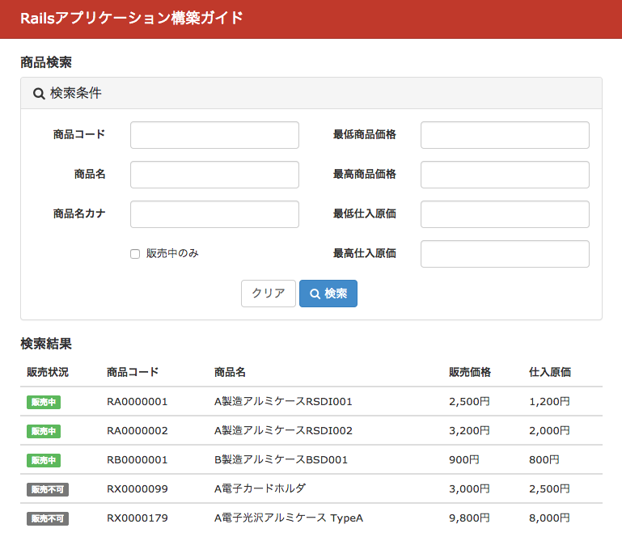
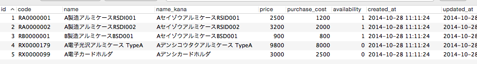

============================================================================
検索フォームの実装
============================================================================

課題: 商品検索画面の実装
============================================================================

今回は業務システムにはつきものの検索画面実装について、以下販売管理システムのサンプルアプリケーションを例に考えてみます。

実装したい画面は下図の通りです。

  販売管理システム - 商品検索画面

システムはproducts(商品)テーブルを持ちます。
productモデルは以下の通りです。

.. code-block:: ruby

  # == Schema Information
  #
  # Table name: products
  #
  #  id            :integer          not null, primary key
  #  code          :string(10)       not null              # 商品コード
  #  name          :string(50)       not null              # 商品名
  #  name_kana     :string(50)       default(""), not null # 商品名カナ
  #  price         :integer          not null              # 商品価格
  #  purchase_cost :integer          not null              # 仕入原価
  #  availability  :boolean          not null              # 販売可能フラグ
  #  created_at    :datetime
  #  updated_at    :datetime
  #

  class Product < ActiveRecord::Base
  end

商品データのサンプルは、下図の通りです。

  商品サンプルデータ

システムの要件は以下の通りです。

- 以下条件で商品を検索できること

  - 商品コードは部分一致検索できること
  - 商品名は部分一致検索できること
  - 商品名カナは部分一致検索できること
  - 以下条件で商品価格が検索可能であること

    - 指定した価格以上の商品が検索できること
    - 指定した価格以下の商品が検索できること

  - 以下条件で仕入原価が検索可能であること

    - 指定した原価以上の商品が検索できること
    - 指定した原価以下の商品が検索できること

  - 販売可能な商品のみ絞り込み検索ができること

.. _form_search_form_object:

検索フォームオブジェクトを利用する
============================================================================

商品検索画面の検索ロジックをどこに置くのがよいでしょうか。

Controller内で複雑なロジックの実装を行ってはいけません。

.. code-block:: ruby

  # [Bad Example] Controller内で複雑なロジックを実装してはいけない
  class ProductsController < ApplicationController
    def search
      t = Product.arel_table
      code = params[:code]
      name = params[:name]
      @products = Product.all
      @products = @products.where(t[:code].matches("%#{code}%")) if code.present?
      @products = @products.where(t[:name].matches("%#{name}%")) if name.present?
      # 以下略
    end
  end

上記は俗に言うFatControllerの原因ともなる実装であり、見通しが悪くテストしにくいコードです。

検索ロジックをProductモデル内に実装するのはどうでしょうか。

悪くない方法ですが、なんでもかんでもProductモデルに詰め込んでしまうと、プロジェクトの規模が大きくなってきた場合に見通しの悪いコードとなってしまいます。

FatModel問題を回避するためにも、検索専用のフォームオブジェクトを作成することをお勧めします。

.. include:: codes/search_object_base.rst

検索ロジックは検索フォームオブジェクトに実装し、
contollerに置くロジックはシンプルなものにとどめておきます。

.. code-block:: ruby

  # app/controller/products_controller.rb

  class ProductsController < ApplicationController
    # 検索画面を初めて開いた段階では、検索結果を表示せず検索フォームのみ表示
    def index
      @product = Search::Product.new
    end

    def search
      @product = Search::Product.new(search_params)
      @products = @product
        .matches
        .order(availability: :desc, code: :asc)
        .decorate
    end

    private

    # 検索フォームから受け取ったパラメータ
    def search_params
      params
        .require(:search_product)
        .permit(Search::Product::ATTRIBUTES)
    end
  end

Viewも以下シンプルなものとなります。

.. code-block:: ruby

  # app/views/products/index.html.erb の一部を抜粋

  <%= form_for(@product, url: search_products_path, html: { method: :get, class: 'form-horizontal', role: 'form' }) do |f| %>
    <%= f.text_field :code, class: 'form-control' %>
    <%= f.text_field :name, class: 'form-control' %>
    # 他は略
  <% end %>

.. code-block:: erb

  # app/views/products/search.html.erb の一部を抜粋

  <table class="table table-list">
  <thead>
    <tr>
      <th>販売状況</th>
      <th>商品コード</th>
      <th>商品名</th>
      <th>販売価格</th>
      <th>仕入原価</th>
    </tr>
  </thead>
  <% @products.each do |product| %>
  <tbody>
  <tr>
    <td><%= product.sales_condition %> </td>
    <td><%= product.code %></td>
    <td><%= product.name %></td>
    <td><%= product.display_price %></td>
    <td><%= product.display_purchase_cost %></td>
  </tr>
  </tbody>
  <% end %>
  </table>

フォームオブジェクトを作成することで、
商品検索画面のロジックを一つのクラスに分離することができました。
このように処理を分割することで、見通しのよいコードが書けるようになります。

Ransackを利用する
============================================================================

検索画面実装にあたり、生のSQLを書かないと実装できない程の複雑なロジックを要求される場合は、
:ref:`form_search_form_object` のように、検索専用のフォームオブジェクトを作成し、
その中にロジックを実装することをお勧めします。

複雑な検索を要求されない場合、わざわざ検索専用のフォームオブジェクトを作成するのは面倒です。
Ransack(https://github.com/activerecord-hackery/ransack)を利用すれば、手軽に検索画面を実装可能です。

Ransackを導入すると、ActiveRecordモデルにsearchとresult関数が追加されます。
search関数では、以下のような記法でデータ検索が可能となります。

.. code-block:: ruby

  # app/models/product.rb

  # == Schema Information
  #
  # Table name: products
  #
  #  id            :integer          not null, primary key
  #  code          :string(10)       not null              # 商品コード
  #  name          :string(50)       not null              # 商品名
  #  name_kana     :string(50)       default(""), not null # 商品名カナ
  #  price         :integer          not null              # 商品価格
  #  purchase_cost :integer          not null              # 仕入原価
  #  availability  :boolean          not null              # 販売可能フラグ
  #  created_at    :datetime
  #  updated_at    :datetime
  #

  class Product < ActiveRecord::Base
  end

.. code-block:: ruby

  # 以下rails consoleにて実行

  # name like で検索 (cont は contains の略)
  irb(main):002:0> Product.search(name_cont: 'ABC').result
    Product Load (6.5ms)  SELECT `products`.* FROM `products`  WHERE (`products`.`name` LIKE '%ABC%')
  => #<ActiveRecord::Relation []>

.. code-block:: ruby

  # name equal で検索
  irb(main):003:0> Product.search(name_eq: 'ABC').result
    Product Load (6.9ms)  SELECT `products`.* FROM `products`  WHERE `products`.`name` = 'ABC'

.. code-block:: ruby

  # price grater than で検索
  => #<ActiveRecord::Relation []>
  irb(main):004:0> Product.search(price_gt: 100).result
    Product Load (1.0ms)  SELECT `products`.* FROM `products`  WHERE (`products`.`price` > 100)

記法の詳細については、RansackのWebサイトをご参照下さい。

検索画面のController/Viewは、Ransackでは以下のように実装します。

.. code-block:: ruby

  # app/controller/products_controller.rb

  class ProductsController < ApplicationController
    def index
      @q = Product.search
    end

    def search
      @q = Product.search(search_params)
      @products = @q
        .result
        .order(availability: :desc, code: :asc)
        .decorate
    end

    private

    def search_params
      search_conditions = %i(
        code_cont name_cont name_kana_cont availability_true
        price_gteq price_lteq purchase_cost_gteq purchase_cost_lteq
      )
      params.require(:q).permit(search_conditions)
    end
  end

.. code-block:: ruby

  # app/views/products/search.html.erb (細かいタグは省略)

  <%= search_form_for(@q, url: search_products_path, html: { method: :get, class: 'form-horizontal', role: 'form' }) do |f| %>

    <%= f.text_field :code_cont, class: 'form-control' %>
    <%= f.text_field :name_cont, class: 'form-control' %>
    <%= f.text_field :name_kana_cont, class: 'form-control' %>

    

      <label>
        <%= f.check_box :availability_true %>
        販売中のみ
      </label>
    

    <%= f.text_field :price_gteq, class: 'form-control' %>
    <%= f.text_field :price_lteq, class: 'form-control' %>
    <%= f.text_field :purchase_cost_gteq, class: 'form-control' %>
    <%= f.text_field :purchase_cost_lteq, class: 'form-control' %>

  <% end %>

フォームをPostすると、以下のようなパラメータをコントローラ内で受け取ることができます。

.. code-block:: ruby

     6: def search
 =>  7:   binding.pry
     8:   @q = Product.search(search_params)
     9:   @products = @q
    10:     .result
    11:     .order(availability: :desc, code: :asc)
    12:     .decorate
    13: end

    [1] pry(#<ProductsController>)> params
    => {"utf8"=>"✓",
     "q"=>{"code_cont"=>"RA", "name_cont"=>"アルミ", "name_kana_cont"=>"アルミ", "availability_true"=>"0", "price_gteq"=>"100", "price_lteq"=>"", "purchase_cost_gteq"=>"", "purchase_cost_lteq"=>""},
     "action"=>"search",
     "controller"=>"products"}

パラメータqの中身を直接Ransackのsearch関数に渡すことで、検索が可能となります。

Ransackを利用する場合は、必ずStrongParameterを利用するようにしましょう。
以下のような実装はするべきではありません。

.. code-block:: ruby

  # app/controller/products_controller.rb

  # [Bad Example] StrongParameterを利用していない実装は避けるべき
  class ProductsController < ApplicationController
    def index
      @q = Product.search
    end

    def search
      @q = Product.search(params[:q])
      @products = @q
        .result
        .order(availability: :desc, code: :asc)
        .decorate
    end
  end

paramの値を直接search関数に渡してはいけません。

パラメータq の値は、ユーザが自由に書き換え可能です。
そのため、検索画面に存在しない項目もパラメータの渡し方次第で検索可能となってしまいます。

思わぬ脆弱性問題に繋がる可能性もあるため、Ransack利用時は必ずStrongParameterを利用するようにしましょう。

サンプルアプリケーション
============================================================================

今回実装したサンプルアプリケーションは、以下ページで取得可能です。

- 検索フォームオブジェクトのサンプル

  - https://github.com/nishio-dens/rails-application-build-guide-sample/tree/master/form/form_object_example

- Ransackを利用した検索フォームのサンプル

  - https://github.com/nishio-dens/rails-application-build-guide-sample/tree/master/form/ransack_search_example
