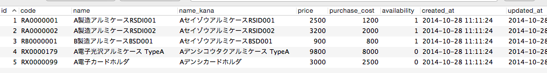

.. _csv_export_basic:

============================================================================
CSVデータ出力の基礎
============================================================================

課題: 商品データのCSV出力
============================================================================

業務システムの場合、データのCSV出力は必須機能かと思います。
販売管理システムを例に、商品データのCSV出力の方法について考えてみます。

今回利用する商品データは、以下のとおりです。

  販売管理システム - 商品データ

ActiveRecordモデルのデータをCSV出力する
============================================================================

Product(商品)モデルのデータをCSV出力する方法について考えてみます。

.. code-block:: ruby

  # 商品の全データをCSV出力する
  Product.all.to_csv

  # 商品ID 1,2,3 のデータをCSV出力する
  Product.where(id: [1,2,3]).to_csv

  # 商品名、価格のみCSV出力、ヘッダも「商品名,価格」という文字列に変更する
  # データはUTF-8で出力
  Product.all.to_csv(header: ['商品名', '価格'], columns: ['name', 'price'], encoding: Encoding::UTF_8)

上記のような記述でCSV出力機能を実現するために、
CsvExportableというapp/models/concerns下のモジュールを作成します。
CsvExportableの実装は以下のとおりです。

.. include:: codes/csv_exportable.rst

このモジュールをActiveRecordモデルに読み込ませることで、データのCSV出力が可能となります。

.. code-block:: ruby

  # app/models/product.rb

  # == Schema Information
  #
  # Table name: products
  #
  #  id            :integer          not null, primary key
  #  code          :string(10)       not null              # 商品コード
  #  name          :string(50)       not null              # 商品名
  #  name_kana     :string(50)       default(""), not null # 商品名カナ
  #  price         :integer          not null              # 商品価格
  #  purchase_cost :integer          not null              # 仕入原価
  #  availability  :boolean          not null              # 販売可能フラグ
  #  created_at    :datetime
  #  updated_at    :datetime
  #
  class Product < ActiveRecord::Base
    include CsvExportable
  end

CsvExportableの実装について補足します。

CSVデータを生成するためには、CSV.generateを利用します。
row_sepは行の区切り文字のことです。

column_names 関数は、ActiveRecordモデルのカラム一覧を取得するための関数です。

.. code-block:: ruby

  irb(main):004:0> Product.column_names
  => ["id", "code", "name", "name_kana", "price", "purchase_cost", "availability", "created_at", "updated_at"]

record.attributes の部分ですが、ActiveRecordのデータに対してattributes関数を実行すると、
DBのカラム名とデータのHashを取ることができます。

.. code-block:: ruby

  irb(main):005:0> Product.first.attributes
  => {
       "id"=>1,
       "code"=>"RA0000001",
       "name"=>"A製造アルミケースRSDI001",
       "name_kana"=>"AセイゾウアルミケースRSID001",
       "price"=>2500,
       "purchase_cost"=>1200,
       "availability"=>true,
       "created_at"=>Mon, 17 Nov 2014 15:02:36 UTC +00:00,
       "updated_at"=>Mon, 17 Nov 2014 15:02:36 UTC +00:00
     }

CSV出力結果は、以下のようになります。

.. code-block:: csv

  # Product.all.to_csv を実行した場合

  id,code,name,name_kana,price,purchase_cost,availability,created_at,updated_at
  1,RA0000001,A製造アルミケースRSDI001,AセイゾウアルミケースRSID001,2500,1200,true,2014-11-17 15:02:36 UTC,2014-11-17 15:02:36 UTC
  2,RA0000002,A製造 アルミケースRSDI002,AセイゾウアルミケースRSID002,3200,2000,true,2014-11-17 15:02:36 UTC,2014-11-17 15:02:36 UTC
  3,RB0000001,B製造アルミケースBSD001,AセイゾウアルミケースBSD001,900,800,true,2014-11-17 15:02:36 UTC,2014-11-17 15:02:36 UTC
  4,RX0000179,A電子光沢アルミケース TypeA,Aデンシコウタクアルミケース TypeA,9800,8000,false,2014-11-17 15:02:36 UTC,2014-11-17 15:02:36 UTC
  5,RX0000099,A電子カードホルダ,Aデンシカードホルダ,3000,2500,false,2014-11-17 15:02:36 UTC,2014-11-17 15:02:36 UTC

.. code-block:: csv

  # Product.all.to_csv(header: ['商品名', '価格'], columns: ['name', 'price'], encoding: Encoding::UTF_8)
  # を実行した場合

  商品名,価格
  A製造アルミケースRSDI001,2500
  A製造アルミケースRSDI002,3200
  B製造アルミケースBSD001,900
  A電子光沢アルミケース TypeA,9800
  A電子カードホルダ,3000

サンプルアプリケーション
============================================================================

サンプルアプリケーションは、以下サイトから取得可能です。

- https://github.com/Rails-Application-Build-Guides/rails-application-build-guide-sample/tree/master/report/csv_export
