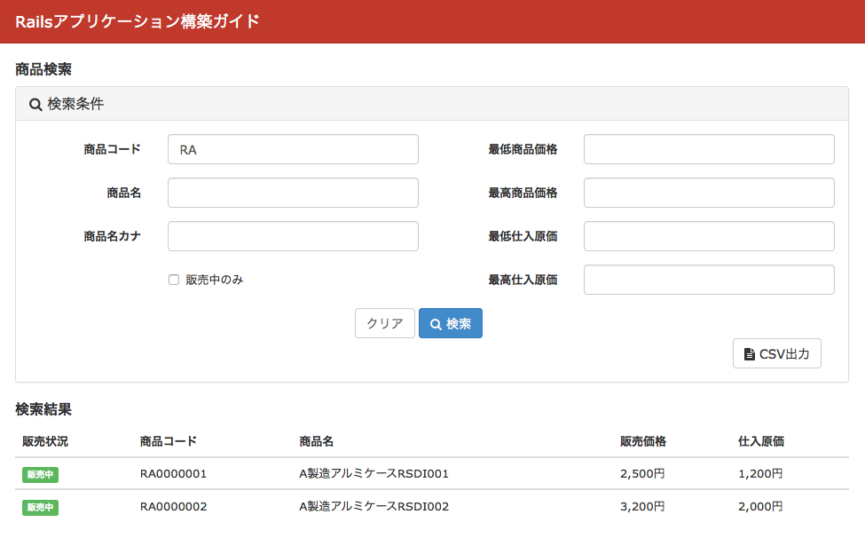

============================================================================
検索結果のCSV出力
============================================================================

課題: 商品検索結果のCSV出力
============================================================================

:ref:`csv_export_basic` では、CSVデータ出力の基本的な実装を紹介しました。

今回は一覧画面の検索結果をCSV出力する方法を検討していきます。
実装する画面イメージは以下のとおりです。

  販売管理システム - 検索結果のCSV出力

商品一覧画面では商品検索が可能です。
CSV出力ボタンを押下すると、検索結果をそのままCSV出力する事が可能です。

.. _csv_export_using_export_csv:

一覧検索とCSV出力の処理を条件分岐してCSV出力をする
============================================================================

検索の際に特殊なパラメータを渡すと、
一覧画面レンダリングではなく、検索結果のCSVを送り返す、という実装にしてみましょう。

検索フォームでは、CSV出力ボタンにname属性'export_csv'を指定します。
この指定をすることで、コントローラに export_csv => '' というパラメータを飛ばすことができます。

.. code-block:: ruby

  <%= form_for(@q, url: search_products_path) do |f| %>

    検索テキストボックスは略

    <%= f.button class: 'btn btn-default btn-primary' do %>
      <i class="fa fa-search"></i> 検索
    <% end %>

    <%= f.button class: 'btn btn-default', name: 'export_csv' do %>
      <i class="fa fa-file-text"></i> CSV出力
    <% end %>

  <% end %>

コントローラに渡されるパラメータ例は以下のとおりです。

.. code-block:: ruby

  [1] pry(#<ProductsController>)> params
  => {"utf8"=>"✓",
   "q"=>{"code_cont"=>"RA", "name_cont"=>"", "name_kana_cont"=>"", "availability_true"=>"0", "price_gteq"=>"", "price_lteq"=>"", "purchase_cost_gteq"=>"", "purchase_cost_lteq"=>""},
   "export_csv"=>"",
   "action"=>"search",
   "controller"=>"products"}

検索用コントローラ内のアクションでは、
以下のようにexport_csvというパラメータを受け取ると、 send_dataでCSVを送り返すようにします。

.. code-block:: ruby

   def search
     @q = Product.search(search_params)
     @products = @q
       .result
       .order(availability: :desc, code: :asc)
       .decorate
     if params[:export_csv]
       send_data @products.to_csv, filename: "#{Time.current.strftime('%Y%m%d')}.csv"
     else
       render :search
     end
   end

一覧検索とCSV出力用のアクションを分けて実装する
============================================================================

:ref:`csv_export_using_export_csv` では、search関数内でCSV出力と検索一覧表示の
ロジックを条件分岐させて実現していました。

別の実装方法として、以下のようにアクション自体を分けてしまう方法について検討しましょう。

.. code-block:: ruby

  class ProductsController < ApplicationController
    before_action :set_products, only: [:search, :export_csv]
 
    def search
    end
  
    def export_csv
      send_data @products.to_csv, filename: "#{Time.current.strftime('%Y%m%d')}.csv"
    end
  
    private
 
    def set_products
      @q = Product.search(search_params)
      @products = @q
        .result
        .order(availability: :desc, code: :asc)
        .decorate
    end
  end

Viewの実装は :ref:`csv_export_using_export_csv` と同じです。
CSV出力ボタンのname属性には、'export_csv'を指定します。

.. code-block:: ruby

  <%= form_for(@q, url: search_products_path) do |f| %>

    検索テキストボックスは略

    <%= f.button class: 'btn btn-default btn-primary' do %>
      <i class="fa fa-search"></i> 検索
    <% end %>

    <%= f.button class: 'btn btn-default', name: 'export_csv' do %>
      <i class="fa fa-file-text"></i> CSV出力
    <% end %>

  <% end %>

export_csv パラメータを渡された際は、/searchアクセスで export_csv 関数が呼び出される、
それ以外の場合はsearch関数が呼び出される、という実装を実現するために、routingの定義を以下のように修正します。

.. code-block:: ruby

  class CsvExportConstraint
    def self.matches?(request)
      request.params.has_key?(:export_csv)
    end
  end
  
  Rails.application.routes.draw do
    root 'products#index'
  
    resources :products, only: [:index] do
      collection do
        get :search, action: :export_csv, constraints: CsvExportConstraint
        get :search
      end
    end
  end

Routingのconstraintsを指定することで、呼び出されるアクションをパラメータにより切り替えることが可能です。

サンプルアプリケーション
============================================================================

サンプルアプリケーションは、以下サイトから取得可能です。

- https://github.com/Rails-Application-Build-Guides/rails-application-build-guide-sample/tree/master/report/search_csv_export

  - 一関数内で処理の条件分岐を行う実装

- https://github.com/Rails-Application-Build-Guides/rails-application-build-guide-sample/tree/master/report/search_csv_export_change_route_example

  - CSV出力用のアクションを作成する実装
